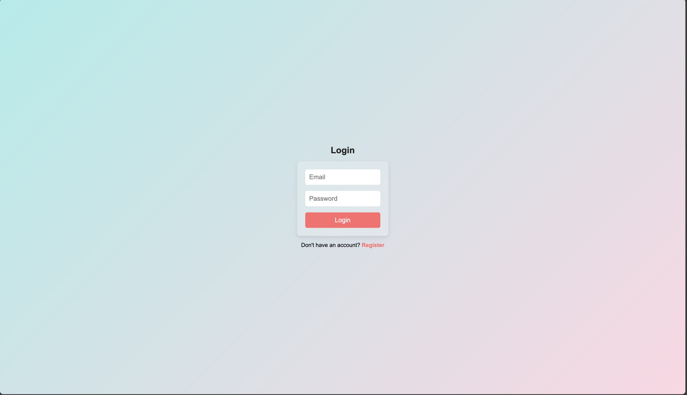
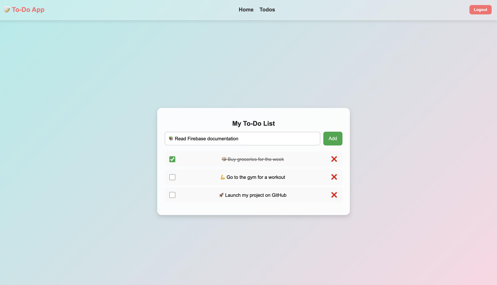

# 📝 To-Do App ✅

This is my first project using Firebase Authentication and Firebase Realtime Database. The app is a simple To-Do List App, allowing users to register, log in, and manage their tasks in real-time.

## 📌 Features
- 🔑 User Authentication (Register, Login, Logout)
- 📁 Firebase Realtime Database (Stores user tasks)
- ➕ Add New Tasks
- ✔️ Mark Tasks as Completed
- ❌ Delete Tasks
- 📊 Tasks Persist in Database (No data loss after refresh)

## 🚀 Technologies Used
- **React.js** ⚛️ (Frontend)
- **Firebase Authentication** 🔑 (User login & signup)
- **Firebase Realtime Database** 🔥 (Data storage)
- **React Router** 🌎 (Navigation)
- **Vite** ⚡ (Fast development)

## 📂 Project Structure
```
📁 To-Do-App
├── 📁 assets
│   ├── login.png
│   ├── todos.png
├── 📁 src
│   ├── 📁 components
│   │   ├── Header
│   │   ├── Home
│   │   ├── Loading
│   │── 📁config
│   │   ├──firebase-config.js
│   ├── 📁 contexts
│   │   ├── AuthContext.jsx
│   │   ├── DatabaseContext.jsx
│   ├── 📁 hoc
│   │   ├── ProtectedRoute.jsx
│   ├── 📁 services
│   │   ├── auth.service.js
│   │   ├── database.service.js
│   ├── 📁 views
│   │   ├── Login
│   │   ├── Register
│   │   ├── Todos
│   ├── 📄 App.css
│   ├── 📄 App.jsx
│   ├── 📄 main.jsx
├── 📄 .env (🔴 NOT INCLUDED IN GIT REPOSITORY)
├── 📄 .gitignore
├── 📄  eslint.config.js
├── 📄 package.json
└── 📄 README.md
└── 📄 vite.config.js
```

## ⚠️ Environment Variables (.env)

This project requires a `.env` file in the root directory with Firebase configuration keys.

🚨 **DO NOT COMMIT `.env` TO GITHUB!** It contains sensitive credentials.

### Example `.env` file:
```ini
VITE_FIREBASE_API_KEY=your_api_key
VITE_FIREBASE_AUTH_DOMAIN=your_auth_domain
VITE_FIREBASE_PROJECT_ID=your_project_id
VITE_FIREBASE_STORAGE_BUCKET=your_storage_bucket
VITE_FIREBASE_MESSAGING_SENDER_ID=your_messaging_sender_id
VITE_FIREBASE_APP_ID=your_app_id
VITE_FIREBASE_DATABASE_URL=your_database_url
```

✔ **Make sure `.env` is listed in `.gitignore` so it does not get pushed to GitHub.**


## 🛠 Installation & Setup
1. **Clone the repository**
    ```sh
    git clone https://github.com/DimitarSr/Firebase-Todo-App.git
    ```
2. **Go to the project folder**
    ```sh
    cd Firebase-Todo-App
    ```
3. **Install dependencies**
    ```sh
    npm install
    ```
4. **Run the app**
    ```sh
    npm run dev
    ```

## 📸 Screenshots
| Login Page | To-Do List |
|------------|------------|
|  |  |


## 📌 Author
👨‍💻 **Dimitar Srabski**

This is my first project using Firebase Authentication and Firebase Realtime Database. 🚀

⭐ If you like this project, don't forget to give it a star on GitHub! 🌟

## ⚠️ Disclaimer
This project was created for **educational purposes only**.  
It is not intended for production use. The code is open-source and can be modified or improved for learning and personal projects.